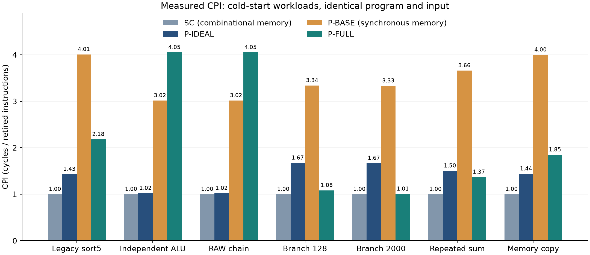
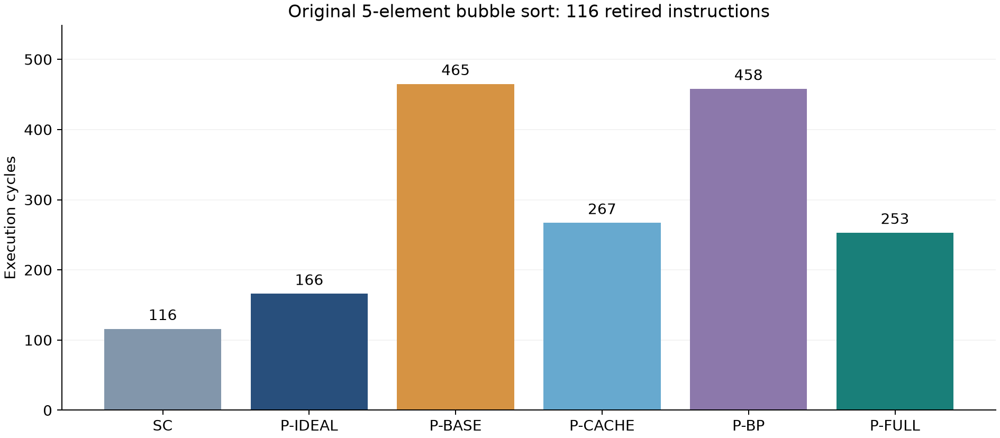
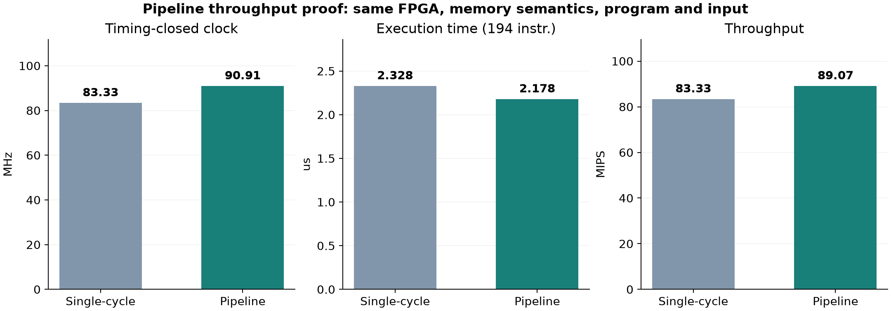

# CPU 性能测试与单周期 CPU 对比

## 1. 实验结论与数据来源

本次使用组员王建乐大三课程的单周期 CPU 源代码及其原始冒泡排序机器码作为比较基准，测量了 7 个程序、6 种配置，共 42 组。完成 2 次独立冷启动重复运行，84 个结果/退休轨迹文件在重复运行间逐文件 SHA-256 一致。每组均通过退休序列、写回值、存储写入顺序及最终寄存器/内存检查。

测量时间：`2026-09-08T18:05:46.6582970+08:00`。工具：Vivado/XSim 2019.2，行为级 RTL 仿真。源项目：`D:\Neon\BIT\Grade3\大三下\计算机组成原理\project\lab2`。原项目仅被读取，未修改。

**结论不是“单周期 CPU 更优秀”。** 同频比较时 SC 周期数更少；但在同一 Artix-7 器件、同一实现流程、相同组合存储器语义下，流水线核心通过了 90.91 MHz 的布线后时序，单周期通过 83.33 MHz。独立 ALU 程序执行同一份 194 条指令时，流水线用 198 周期、2.178 μs，SC 用 194 周期、2.328 μs；流水线吞吐加速比为 **1.069×**。因此本实验支持“流水线在连续计算吞吐、执行时间和 MIPS 上更优秀”，不支持“所有工作负载均更快”。

这里的周期数是 **2026 年本次重新测量旧设计所得**，不能改写成大三原实验当时已经记录的性能数值。保留的原始机器码、数据文件与历史时序报告构成历史设计来源证据。历史时序报告日期为 2026-06-11，明确写有 `There are no user specified timing constraints.`，WNS/TNS 为 NA，因此本报告不从历史报告推导 Fmax，也不把原测试平台的 10 ns 时钟当成硬件已达到 100 MHz 的证据。

## 2. 单周期基线的基本结构

原设计采用 PC、指令存储器、组合译码器、立即数生成器、32×32 位寄存器堆、ALU 和数据存储器。指令存储器及数据存储器均组合读，寄存器及数据存储器在上升沿写入。

一条指令在一个周期内完成取指、译码、运算、必要的访存与写回。BEQ 使用 ALU 减法结果判断相等，在同一周期选择 `PC+4` 或 `PC+偏移`。没有流水寄存器、Cache 和分支预测，也就没有本项目的流水线相关停顿。

本次测试使用双方明确支持的共同指令：`ADD SUB SLT ADDI ORI LW SW BEQ`。采用自然对齐的 32 位访问，不触发溢出、异常、中断或 MMIO。原始排序使用其中 `ADD SUB SLT ORI LW SW BEQ`。

原寄存器堆依赖 `initial` 清零，写使能未由复位屏蔽。为避免复位期间反复执行第一条自增指令，新增 ALU 两个测试以 `ADDI x0,x0,0` 开头。其余程序首指令均幂等初始化；原始排序机器码保持不变。该启动约束不计为对原 RTL 的修复，原模块逻辑没有修改。

## 3. 公平性与配置矩阵

| 编号 | 配置 | 存储器读行为 | Cache | 预测 |
|---|---|---|---|---|
| 0 | SC | 原 256 字组合读 IMEM/DMEM | 无 | 无 |
| 1 | P-IDEAL | 测试平台组合读，ready 立即有效 | 无 | 关闭 |
| 2 | P-BASE | 当前同步 IMEM/DMEM 握手状态机 | 关闭 | 关闭 |
| 3 | P-CACHE | 同 P-BASE | I/D 各 1 KiB | 关闭 |
| 4 | P-BP | 同 P-BASE | 关闭 | 16 项 BTB + BHT |
| 5 | P-FULL | 同 P-BASE | I/D 各 1 KiB | 开启 |

- 同一程序在六种配置中使用逐字相同的指令镜像、初始数据和全零通用寄存器。
- 所有配置 IMEM/DMEM 均为 256×32 位。原始排序的前 21 个机器字逐字复用历史文件，其余 IMEM 按旧模块默认值补 NOP；数据尾部补零，未改变原程序或输入语义。
- 基准测试数据地址统一为 `0x00000000` 起。流水线测试封装使用已有参数 `dcache.CACHEABLE_BASE=0`、`data_memory.BASE_ADDR=0`，无需修改 CPU、Cache 或存储器状态机。当前板级 SoC 的数据 RAM 基址为 `0x10000000`，因此本实验是 **CPU 与存储子系统对比**，不代表完整板级外设程序计时。
- P-IDEAL 与 SC 的存储读写时序相同，用于观察流水线填充、相关停顿与控制转移代价。P-BASE/P-CACHE/P-BP/P-FULL 共享相同下层握手模型，用于开关对比。
- 每次从复位和空 Cache/预测表开始，不做预热。初始化、冷缺失、流水线填充及终止指令退休前的等待均计入。
- 两类 CPU 的组合关键路径和可实现频率不同，本次不将相同仿真时钟解释为相同实际硬件能力。

## 4. 测试程序与正确性检查

| 程序 | 设计目的 | 固定输入 / 预期输出 |
|---|---|---|
| legacy_sort5 | 历史课程程序，混合运算/访存/分支 | `[7,3,9,1,5]` 排为 `[1,3,5,7,9]`，12 次 SW |
| alu_independent | 192 条运算轮流写 6 个寄存器 | x1～x6 均为 32 |
| raw_chain | 192 条连续相邻 RAW 依赖 | x1=192 |
| branch_loop | 128 次循环，观察方向学习 | x1=128 |
| branch_steady | 2000 次循环，摊薄流水填充与 Cache 冷启动 | x1=2000 |
| load_use_sum | 32 个字重复求和 4 遍，128 次加载 | x1=2112 |
| memory_copy | 32 次紧邻 LW/SW，观察 store-data 依赖 | 1～32 从字节地址 0 复制到 256 |

`prepare.py` 内置独立的顺序执行参考模型，从机器码解码生成期望退休 PC、指令、目标寄存器、写回值、存储写入事件以及最终全状态；同时以手工可计算的排序/求和/复制结果交叉检查。仿真不调用参考模型执行硬件逻辑。

每次退休检查 PC 与机器码，在该上升沿写回完成后检查目标寄存器值。每次数据写握手检查地址、数据和事件顺序。终止时检查全部 32 个寄存器、256 个数据字、存储次数，且不得产生异常或中断。流水线硬件周期/退休计数器还须与独立测试平台计数一致。超时、漏指令、重复退休、错误写入均使测试失败。

## 5. 计数边界与指标定义

计数从复位释放后的第一个有效上升沿开始，直到 `done` 处的 `BEQ x0,x0,done` **第一次退休**，含该终止指令。原始排序停止 PC 为 `0x50`。终止自循环之后的重复执行不计入，复位周期及仿真器编译时间不计入。初始 NOP（存在时）计入。采用最终指令退休边界，而非仅观察 PC 提前到达终点或 MEM 级写完成。

```text
N = 测量区间内退休指令数
C = 测量区间内有效时钟周期数
CPI = C / N
IPC = N / C
模型执行时间(μs) = C / f_MHz
模型 MIPS = f_MHz × IPC
同频加速比(A 相对 B) = C_B / C_A
不同频率加速比(A 相对 B) = (C_B / f_B) / (C_A / f_A)
```

统一模型频率取 100 MHz（`always #5 clk=~clk`，时钟周期 10 ns）。时间为完整执行周期槽数乘周期长度，不是两个事件时间戳相减，也不是工具墙钟运行时间。100 MHz 的 CPU 时间和 MIPS 是 **行为模型换算值**，并非通过静态时序验证的板上实测性能。CPI/IPC 可直接从真实仿真计数获得，是本次主要评价指标；MIPS 仅用于相同 ISA/程序下辅助展示。

所有原始整型计数见 [results.csv](performance/results.csv)。表格显示值仅在展示时四舍五入，计算用原始整数。

## 6. 实测结果

### 6.1 全部测试周期数

| 测试程序 | 退休指令数 | SC | P-IDEAL | P-BASE | P-CACHE | P-BP | P-FULL |
|---|---|---|---|---|---|---|---|
| 原始 5 元素冒泡排序 | 116 | 116 | 166 | 465 | 267 | 458 | 253 |
| 独立运算 | 194 | 194 | 198 | 585 | 786 | 585 | 786 |
| 连续 RAW 依赖 | 194 | 194 | 198 | 585 | 786 | 585 | 786 |
| 分支循环（128 次） | 386 | 386 | 646 | 1289 | 670 | 1163 | 418 |
| 稳态分支循环（2000 次） | 6002 | 6002 | 10006 | 20009 | 10030 | 18011 | 6034 |
| 重复数组求和 | 786 | 786 | 1182 | 2877 | 1326 | 2752 | 1076 |
| 内存复制 | 227 | 227 | 327 | 908 | 480 | 878 | 420 |

### 6.2 全部测试 CPI

| 测试程序 | SC | P-IDEAL | P-BASE | P-CACHE | P-BP | P-FULL |
|---|---|---|---|---|---|---|
| 原始 5 元素冒泡排序 | 1.0000 | 1.4310 | 4.0086 | 2.3017 | 3.9483 | 2.1810 |
| 独立运算 | 1.0000 | 1.0206 | 3.0155 | 4.0515 | 3.0155 | 4.0515 |
| 连续 RAW 依赖 | 1.0000 | 1.0206 | 3.0155 | 4.0515 | 3.0155 | 4.0515 |
| 分支循环（128 次） | 1.0000 | 1.6736 | 3.3394 | 1.7358 | 3.0130 | 1.0829 |
| 稳态分支循环（2000 次） | 1.0000 | 1.6671 | 3.3337 | 1.6711 | 3.0008 | 1.0053 |
| 重复数组求和 | 1.0000 | 1.5038 | 3.6603 | 1.6870 | 3.5013 | 1.3690 |
| 内存复制 | 1.0000 | 1.4405 | 4.0000 | 2.1145 | 3.8678 | 1.8502 |



IPC 为上述 CPI 的倒数，42 组完整 IPC、模型时间和模型 MIPS 见 CSV。

### 6.3 大三原始排序程序详细对比

| 配置 | 周期 | CPI | IPC | 100 MHz 模型时间 / μs | 100 MHz 模型 MIPS |
|---|---|---|---|---|---|
| SC 原单周期 | 116 | 1.0000 | 1.0000 | 1.16 | 100.00 |
| P-IDEAL 理想存储流水线 | 166 | 1.4310 | 0.6988 | 1.66 | 69.88 |
| P-BASE 同步存储流水线 | 465 | 4.0086 | 0.2495 | 4.65 | 24.95 |
| P-CACHE 双 Cache | 267 | 2.3017 | 0.4345 | 2.67 | 43.45 |
| P-BP 分支预测 | 458 | 3.9483 | 0.2533 | 4.58 | 25.33 |
| P-FULL 双 Cache + 预测 | 253 | 2.1810 | 0.4585 | 2.53 | 45.85 |



该程序原测试平台只固定等待 200 周期，没有退休终止计数输出，因此不能直接以“200 周期”当作排序完成耗时。本次原设计完成排序并首次执行终止分支共 116 周期，输出数组与历史输入对应的预期排序一致。

### 6.4 Cache/预测开关贡献

| 测试程序 | P-BASE / P-FULL 周期比 | P-FULL 周期减少 | P-FULL 胜过 SC 所需频率比 |
|---|---|---|---|
| 原始 5 元素冒泡排序 | 1.838× | 45.59% | > 2.181 |
| 独立运算 | 0.744× | -34.36% | > 4.052 |
| 连续 RAW 依赖 | 0.744× | -34.36% | > 4.052 |
| 分支循环（128 次） | 3.084× | 67.57% | > 1.083 |
| 稳态分支循环（2000 次） | 3.316× | 69.84% | > 1.005 |
| 重复数组求和 | 2.674× | 62.60% | > 1.369 |
| 内存复制 | 2.162× | 53.74% | > 1.850 |

负的“周期减少”表示变慢。所需频率比为 `f_P-FULL / f_SC > C_P-FULL / C_SC`，是胜出条件而非已实现频率。

### 6.5 布线后时序与连续计算吞吐实验

两种顶层均在 `xc7a35tcsg324-1` 上使用 Vivado 2019.2 的相同 `synth_design → opt_design → place_design → phys_opt_design → route_design` 流程，并使用相同的 256×32 位组合读 IMEM/DMEM。P-IDEAL 是当前五级流水 CPU，关闭 Cache 和预测以隔离流水化本身。先施加 2 ns 压力约束，由布线后 WNS 得到关键周期估计；再对同一布线结果分别以 SC=12 ns、流水线=11 ns 重新约束，二者 WNS 均为正，作为可用工作点。该验证是静态时序结果，不等同于板上电压、温度和外设条件下的实测。

| 设计 | 关键周期估计 / ns | Fmax 估计 / MHz | 验证周期 / ns | 验证频率 / MHz | 验证 WNS / ns | Slice LUT | 寄存器 |
|---|---|---|---|---|---|---|---|
| SC 原单周期 | 11.666 | 85.72 | 12.000 | 83.33 | 0.334 | 723 | 352 |
| P-IDEAL 理想存储流水线 | 10.661 | 93.80 | 11.000 | 90.91 | 0.339 | 1997 | 2051 |

连续计算程序从冷复位开始，包含 192 条彼此独立的 ALU 运算；两种 CPU 使用逐字相同的机器码和输入。执行时间使用各自已通过时序的工作频率，而不是统一的 100 MHz 仿真时钟。

| 设计 | 退休指令 | 周期 | CPI | 通过时序频率 / MHz | 执行时间 / μs | MIPS |
|---|---|---|---|---|---|---|
| SC 原单周期 | 194 | 194 | 1.0000 | 83.33 | 2.328 | 83.33 |
| P-IDEAL 理想存储流水线 | 194 | 198 | 1.0206 | 90.91 | 2.178 | 89.07 |



P-IDEAL 相比 SC 多 4 个流水填充周期，胜出所需频率比为 1.0206；已通过时序的频率比为 1.0909。据此，流水线的执行时间缩短 6.44%，MIPS 提高 6.89%。资源代价见上表，故“更优秀”在这里具体指连续计算的吞吐和执行时间。

## 7. 结果解释

### 7.1 前递可以消除本次 ALU 连续依赖的额外停顿

独立运算与 RAW 链在 P-IDEAL 下均为 198 周期、194 条退休指令、0 次数据气泡。符合 `198=194+4`，其中 4 为五级流水初始填充开销。前递使本次连续 ALU 依赖不再额外增加周期，但单发射五级流水的稳态上限仍为每周期一条，并非每周期五条。

### 7.2 理想存储条件下也存在加载与分支代价

原始排序 P-IDEAL 的周期可由实测事件解释为：`166=116+4+10+2×18`。其中 10 次 load-use 气泡，18 次非终止分支误预测各引入两级清除代价。所有 P-IDEAL 用例都通过 `C=N+4+stall_data+2×非终止误预测数` 的分析断言。这一等式仅适用于本次理想存储实验，不能机械套用到同步存储及 Cache 场景。

### 7.3 当前同步存储接口限制顺序吞吐

下层存储器采用 `IDLE / RESPOND / TURNAROUND` 状态机，同一接口完成请求后还需周转，因此未缓存取指不能每周期接受新指令。独立运算 P-BASE 的 585 周期，包含 389 个 `stall_fetch` 计数，CPI≈3.0155。重复求和 P-BASE 的取指等待为 1829，表明当前基线不仅受 ALU 或数据相关影响。

### 7.4 Cache 对有复用的程序有效，对冷顺序代码可能更慢

原始排序 P-BASE/P-CACHE 为 465/267 周期，单独开 Cache 的周期比 1.742×。重复求和 P-BASE/P-CACHE 为 2877/1326，周期比 2.170×。

但独立运算与 RAW 链各有 194 个连续机器字，仅执行一遍，Cache 冷启动产生 49 次 I-Cache 行缺失和 588 个取指等待周期。每次需按 4 个字逐次回填，且原握手没有突发传输，最终 786 周期比无 Cache 的 585 周期更多。容量足够并不等于冷启动没有代价。本次不删除或隐藏这些负收益结果。

### 7.5 分支预测依赖程序行为

| 测试程序 | 非终止分支数 | P-CACHE 错误数 | P-FULL 错误数 | P-FULL 准确率 |
|---|---|---|---|---|
| 原始 5 元素冒泡排序 | 33 | 18 | 11 | 66.67% |
| 分支循环（128 次） | 255 | 128 | 2 | 99.22% |
| 稳态分支循环（2000 次） | 3999 | 2000 | 2 | 99.95% |
| 重复数组求和 | 259 | 132 | 7 | 97.30% |
| 内存复制 | 63 | 32 | 2 | 96.83% |

分支统计由测试平台在实际 EX 接受事件处独立采集，明确排除 `done` 自循环，分母与参考模型的非终止分支数一致。无动态预测配置按静态不跳转判断错误数。原单周期 CPU 不存在投机预测，因此不报告其“预测准确率”。直线代码分母为 0，准确率标为不适用。

分支循环开启 Cache 后，开/关预测的周期为 418/670，错误数从 128 降至 2，验证循环预测有效。原始排序含数据相关分支，P-FULL 仍有 11 次错误，说明不能把规律循环的预测收益直接套用到所有程序。

### 7.6 原始排序诊断计数

| 配置（原始排序） | 数据气泡 | 取指等待 | 数据等待 | 重定向次数 | 有效分支 / 错误预测 |
|---|---|---|---|---|---|
| P-IDEAL 理想存储流水线 | 10 | 0 | 0 | 19 | 33 / 18 |
| P-BASE 同步存储流水线 | 0 | 297 | 32 | 19 | 33 / 18 |
| P-CACHE 双 Cache | 10 | 61 | 41 | 19 | 33 / 18 |
| P-BP 分支预测 | 0 | 297 | 32 | 12 | 33 / 11 |
| P-FULL 双 Cache + 预测 | 10 | 61 | 41 | 12 | 33 / 11 |

硬件 `flush` 是重定向次数，不是损失周期数，且可能包含终止分支。`stall_data`、`stall_fetch`、`stall_memory` 各自按 RTL 门控条件计数，不能默认与有效指令构成严格互斥的周期分解。无 Cache 时数据等待可能先于经典 load-use 冒险发生，故 `stall_data=0` 并不表示没有加载代价。

I/D Cache 的 hit/miss 字段在 CSV 中保留为 RTL 原始计数。特别是 I-Cache 查询包含前端保持、推测取指或终止点附近请求，不等于退休指令数；不将 `hit/(hit+miss)` 直接标作架构级命中率。本次主要用总周期量化 Cache 的实际贡献。

## 8. 可复现步骤与文件说明

在项目根目录运行（PowerShell）：

```powershell
# 使用已保存的原设计快照，无需访问旧目录；默认重复两次并核对输出哈希
powershell -ExecutionPolicy Bypass -File sim/performance/run.ps1 -UseSnapshot

# 仅重跑行为仿真，并复用现有布局布线报告
powershell -ExecutionPolicy Bypass -File sim/performance/run.ps1 -UseSnapshot -SkipImplementation

# 如工具安装路径不同
powershell -ExecutionPolicy Bypass -File sim/performance/run.ps1 -UseSnapshot `
  -Vivado '你的路径/vivado.bat' -Python '你的路径/python.exe'
```

Python 分析使用标准库及 `matplotlib`、`numpy`。不传 `-UseSnapshot` 时脚本从 `-Legacy` 指定目录重新读取快照，原目录始终只读。RTL 快照只对模块名添加 `perf_legacy_` 前缀，避免与当前同名模块冲突，逻辑未修改。`perf_paths.vh` 由脚本生成以适配当前工作目录。

| 文件 | 用途 |
|---|---|
| [results.csv](performance/results.csv) | 42 组原始计数和派生指标 |
| [timing_results.csv](performance/timing_results.csv) | 同器件布线后 WNS、关键周期、Fmax 估计与资源 |
| [run_metadata.json](performance/run_metadata.json) | 时间、重复次数、结果与轨迹哈希 |
| [source_manifest.json](performance/source_manifest.json) | 旧源文件及快照 SHA-256 |
| [current_sources.json](performance/current_sources.json) | 本次当前 RTL 版本哈希 |
| [historical_timing_summary.rpt](performance/historical_timing_summary.rpt) | 原始无约束时序报告证据 |
| [raw/simulation.log](performance/raw/simulation.log) | 42 组 PASS 总日志 |
| `performance/timing/*_timing_summary.rpt` | Vivado 2 ns 压力约束布线后时序报告 |
| `performance/timing/*_timing_closed_summary.rpt` | 11/12 ns 正 WNS 验证报告 |
| `performance/timing/*_utilization.rpt` | Vivado 布线后资源报告 |
| `performance/raw/*.trace.csv` | 每组逐条退休周期、PC、机器码与经断言验证的写回值 |
| `../sim/performance/programs/` | 测试汇编、相同机器码、输入及参考状态 |
| `../sim/performance/perf_case.sv` | 统一测试封装与自检逻辑 |
| `../sim/performance/prepare.py` | 机器码生成与独立参考模型 |
| `../sim/performance/analyze.py` | 结果校验、公式计算、图表和本文生成 |

## 9. 可用于报告的结论与剩余限制

本次实验基于组员真实旧设计及原始排序程序建立了可复现基准，完成 CPU 性能量化。五级流水与前递使理想存储下连续 ALU 指令接近 CPI=1；加载和控制相关会增加周期。当前同步存储基线存在明显取指等待，Cache 与分支预测对循环、重复访存等负载有效，但冷启动顺序代码可能退化。

本次功能仿真和布线后静态时序共同证明：当前流水线在连续独立 ALU 计算上具有更高的估计 MIPS 和更短的估计执行时间。短小、分支密集、冷启动或一次性顺序程序仍可能由流水填充、相关清除、Cache 回填和存储握手主导；原始 5 元素排序就是反例。最终报告应把结论写为“在连续计算吞吐指标上胜出”，并将完整 SoC 的时序优化、板上实测频率、功耗和门级时序仿真列为后续工作。
