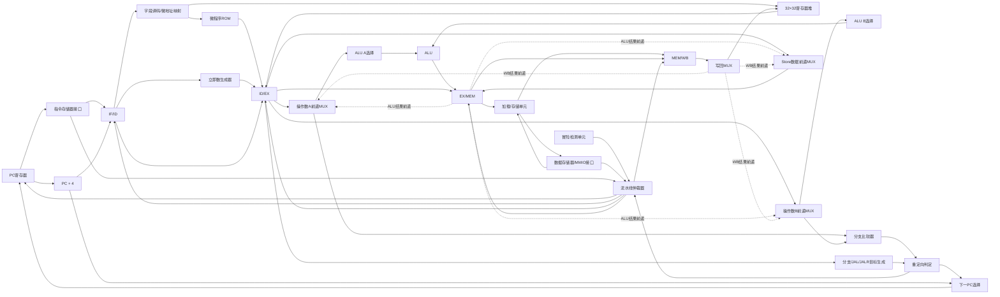

# 五级流水完整数据通路图

## 1. 数据通路



## 2. 各级组合逻辑边界

| 流水级 | 输入 | 主要组合逻辑 | 输出寄存器 |
|---|---|---|---|
| IF | PC | `PC+4`、指令请求、下一 PC 选择 | IF/ID |
| ID | IF/ID | 指令译码、寄存器读取、立即数生成、微码查询、load-use 检测 | ID/EX |
| EX | ID/EX | 前递选择、ALU、分支比较、目标计算、重定向判断 | EX/MEM |
| MEM | EX/MEM | 字节使能、存储器握手、加载字节选择与扩展 | MEM/WB |
| WB | MEM/WB | ALU/MEM/PC+4 写回选择、退休 | 寄存器堆 |

## 3. 关键路径说明

- R/I 型 ALU：`寄存器堆 → ID/EX → 前递 MUX → ALU → EX/MEM → MEM/WB → 写回 MUX`。
- load：地址在 EX 计算，MEM 完成读取，WB 写回；紧邻消费者需停顿一个周期。
- store：地址由 ALU 计算，写数据单独经过 store-data 前递路径。
- branch：EX 使用前递后的两个源操作数比较；taken 时下一周期从目标地址取指，并冲刷 IF/ID、ID/EX。
- JAL/JALR：EX 产生目标地址，WB 将原指令 `PC+4` 写入 rd。

## 4. 基础时序示例

```text
周期       1    2    3    4    5    6    7
LW x1      IF   ID   EX   MEM  WB
ADD x2,x1       IF   ID   --   EX   MEM  WB
说明：第 4 周期保持 PC/IF-ID，并向 ID/EX 插入一个气泡；第 5 周期从 MEM/WB 前递 x1。
```

```text
周期       1    2    3    4    5    6
BEQ(taken) IF   ID   EX   MEM  WB
顺序指令1       IF   ID   XX
顺序指令2            IF   XX
目标指令                  IF   ID   EX
说明：EX 确认跳转后作废两条年轻指令，分支自身继续进入 EX/MEM。
```
